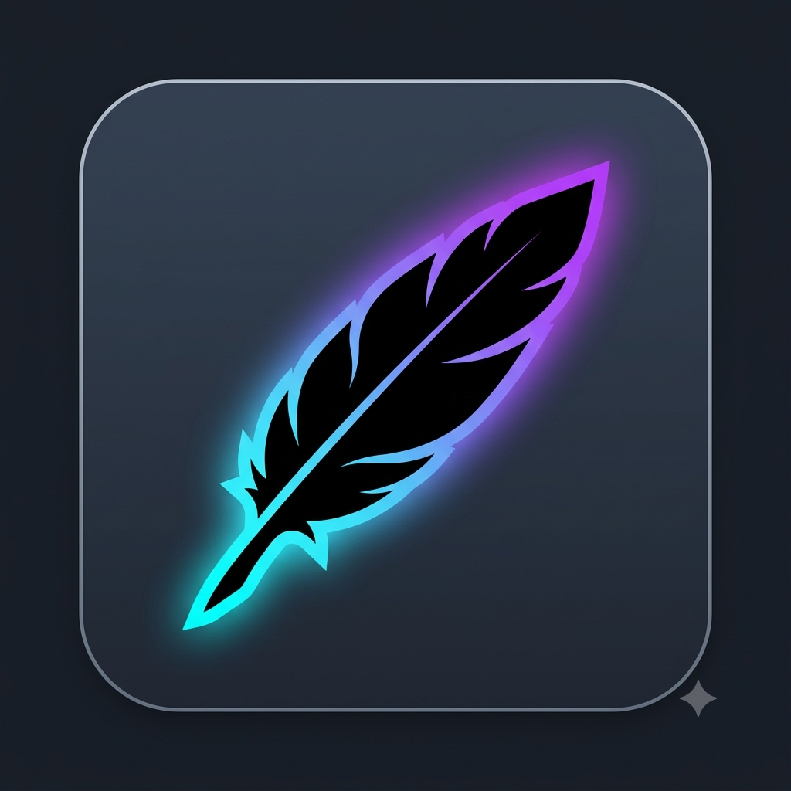

<div align="center">



# DriftBreak
**Local Context Governor & Cognitive State-Recovery Engine for Local AI Systems**

[](https://github.com/Recursive-Logic-Core/DriftBreak/releases)
[](https://opensource.org/licenses/MIT)
[]()

<br />

<a href="https://github.com/Recursive-Logic-Core/DriftBreak/releases/latest/download/DriftBreak.exe">
  
</a>

<p><em>Single-file standalone application — No Python installation required.</em></p>

</div>
**Architecture & Protocol Specification**  
Designed and specified by Architect M.M.M. The Python implementation serves strictly as an execution runtime artifact.

---

## ⚡ What is DriftBreak?

DriftBreak helps prevent cognitive context-drift and oversized chat histories in long-running local LLM sessions. It extracts and structures established facts, active constraints, and project terminology (State + Glossary) from your conversation log into a lean Recovery Payload.

You load the generated payload into your next session. By reducing context length, the inference engine requires significantly less KV-Cache memory, while model weights remain loaded in GPU VRAM.

### Core Architecture
- **100% Offline & Localhost-Only:** Operates strictly on loopback (`127.0.0.1`). Zero telemetry, zero external network calls.
- **Lean Recovery Payload:** Compresses history into a structured context object (State + Glossary + optional recent turns). Less context length means reduced KV-cache allocation without cold model unloads.
- **Chronological Session Vault:** Stores raw chat backups, cumulative state histories, and glossaries inside sequential directories (`sessions/00001/`, `sessions/00002/`).
- **Deterministic Checkpoint Modes:**
  - `keep 0`: Complete reset (empty payload, new session folder; baseline glossary archived to disk).
  - `keep 1–15`: Active payload injection combining verified State + cumulative Glossary + specified recent turns.
- **Atomic Persistence:** Safe temp-file writes prevent JSON corruption during execution or user interrupts.

---

## 🚀 Quick Start (For End-Users)

1. Download **`DriftBreak.exe`** from the button above.
2. Place it in any folder and paste your conversation log into `session_input.txt`.
3. Run **`DriftBreak.exe`** and select your local backend node.
4. Use the generated `pruned_context_payload.json` inside your session directory to resume execution with structured continuity (State + Glossary + recent turns).

---

## 🛠️ Developer Setup (From Source)

```bash
# Clone the repository
git clone https://github.com/Recursive-Logic-Core/DriftBreak.git
cd DriftBreak

# Install requirements
pip install requests

# Run application
python DriftBreak.py
```

## Contact & Architecture Core
Developed and maintained by **Architect M.M.M.**  
Direct contact: `arch_mmm@proton.me`
